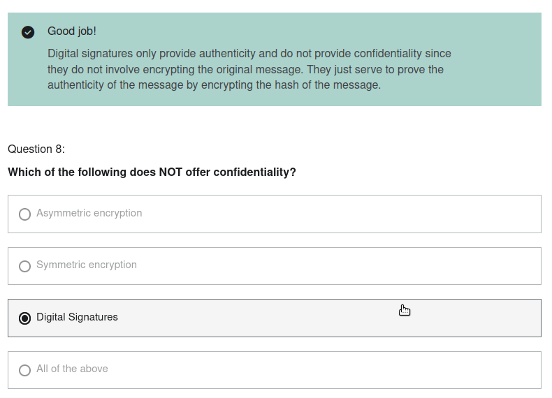

# Hashing & Digital Signature

Tanda tangan digital hanya memberikan keaslian dan tidak memberikan kerahasiaan karena tidak melibatkan enkripsi pesan asli. Mereka hanya berfungsi untuk membuktikan keaslian pesan dengan mengenkripsi hash pesan.
